---
## Front matter
title: "Отчёт по лабораторной работе №2"
subtitle: "дисциплина: Архитектура вычислительных систем"
author: "Мосолов Александр Денисович"

## Generic otions
lang: ru-RU
toc-title: "Содержание"

## Bibliography
bibliography: bib/cite.bib
csl: pandoc/csl/gost-r-7-0-5-2008-numeric.csl

## Pdf output format
toc: true # Table of contents
toc-depth: 2
lof: true # List of figures
lot: true # List of tables
fontsize: 12pt
linestretch: 1.5
papersize: a4
documentclass: scrreprt
## I18n polyglossia
polyglossia-lang:
  name: russian
  options:
	- spelling=modern
	- babelshorthands=true
polyglossia-otherlangs:
  name: english
## I18n babel
babel-lang: russian
babel-otherlangs: english
## Fonts
mainfont: PT Serif
romanfont: PT Serif
sansfont: PT Sans
monofont: PT Mono
mainfontoptions: Ligatures=TeX
romanfontoptions: Ligatures=TeX
sansfontoptions: Ligatures=TeX,Scale=MatchLowercase
monofontoptions: Scale=MatchLowercase,Scale=0.9
## Biblatex
biblatex: true
biblio-style: "gost-numeric"
biblatexoptions:
  - parentracker=true
  - backend=biber
  - hyperref=auto
  - language=auto
  - autolang=other*
  - citestyle=gost-numeric
## Pandoc-crossref LaTeX customization
figureTitle: "Рис."
tableTitle: "Таблица"
listingTitle: "Листинг"
lofTitle: "Список иллюстраций"
lotTitle: "Список таблиц"
lolTitle: "Листинги"
## Misc options
indent: true
header-includes:
  - \usepackage{indentfirst}
  - \usepackage{float} # keep figures where there are in the text
  - \floatplacement{figure}{H} # keep figures where there are in the text
---

# Цель работы

Целью работы является изучить идеологию и применение средств контроля
версий. Приобрести практические навыки по работе с системой *git*.

# Выполнение лабораторной работы

## Базовая настройка git

Сделаем предварительную конфигурацию git. Для этого вводим
команды, представленные на картинке (рис. fig:001), указывая своё имя и email.

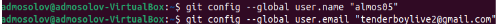{#fig:001 width=70%}

В выводе сообщений *git* настроим кодировку *utf-8*.

{#fig:002 width=70%}

Зададим название начальной ветки, назовём её *master*

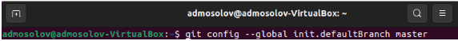{#fig:003 width=70%}

Подключаем параметры *core.safecrlf warn* и *core.autocrlf input*.

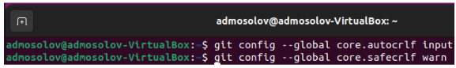{#fig:004 width=70%}

## Создание SSH ключа

С помощью команды *ssh-keygen -C* создаём пару ключей, они сохранятся в
каталоге *~/.ssh/.* Просмотрим содержимое этого каталога с помощью *ls*.

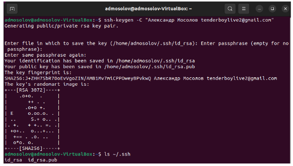{#fig:005 width=70%}

Сгенерированный ключ загружаем в раздел SSH and GPG keys. Для ключа
указываем имя Title.

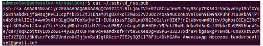{#fig:006 width=70%}

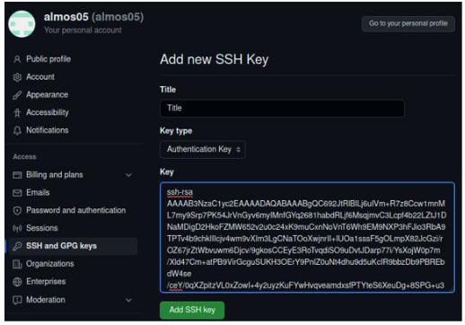{#fig:007 width=70%}

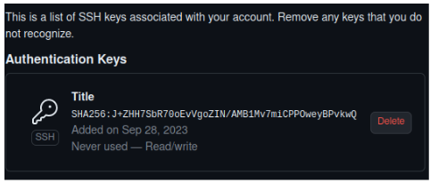{#fig:008 width=70%}

## Создание рабочего пространства и репозитория курса

Создаем рабочее пространство, с помощью команды *mkdir -p ~/work/study/2023-
2024/"Архитектура компьютера"* составляем каталог, состоящий из других
подкаталогов (используя параметр *-p*).

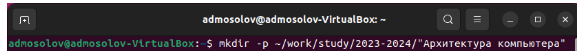{#fig:009 width=70%}

## Создание репозитория курса на основе шаблона

Переходим по ссылке, используем в качестве репозитория шаблон.

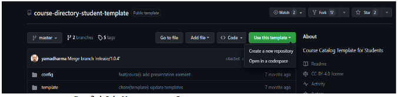{#fig:010 width=70%}

Создаем свой репозиторий с названием *study_2023-2024_arh-pc*.

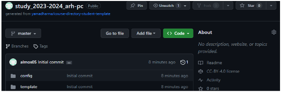{#fig:011 width=70%}

Копируем ссылку для клонирования в разделе Code/SSH. Переходим в каталог
курса *cd ~/work/study/2023-2024/"Архитектура компьютера"*. И с помощью команды
*git clone –recursive git@github.com:almos05/study_2023-2024_arh-pc.git arch-pc*
клонируем репозиторий.

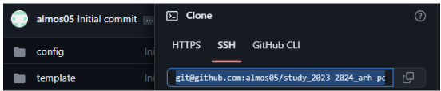{#fig:012 width=70%}

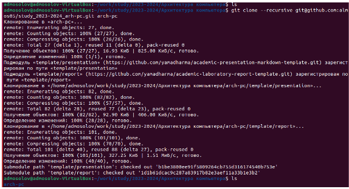{#fig:013 width=70%}

## Настройка каталога курса

Переходим каталог курса: *cd ~/work/study/2023-2024/"Архитектура
компьютера"/study_2023-2024_arh-pc*. Удаляем лишние файлы: *rm package.json*

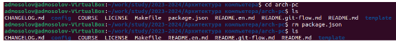{#fig:014 width=70%}

Создаем необходимые каталоги и отправляем файлы на сервер. Для сохранения
изменений на сервере мы используем цепочку команд: *git add . git commit -am
‘комментарий’ git push*.

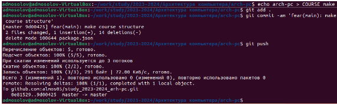{#fig:015 width=70%}

Проверим правильность создания иерархии рабочего пространства. На
странице *github* мы видим, что текстовый файл формата *json – package.json* был
удалён, помимо этого появился комментарий: *fear(main) make course structure*.

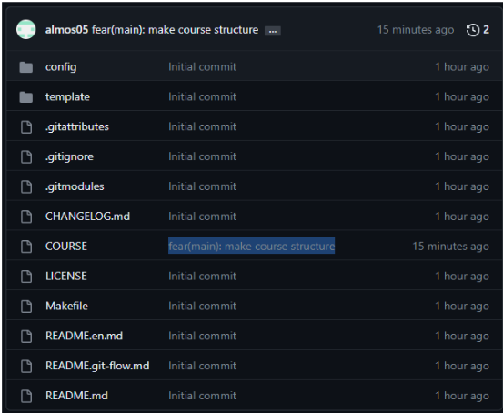{#fig:016 width=70%}

Создаём каталог labs и три подкаталога lab01, lab02, lab03

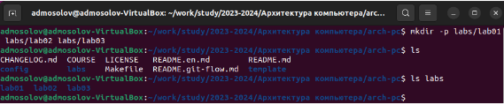{#fig:017 width=70%}

С помощью mv перемещаем лабораторную работу №1 в каталог lab01.

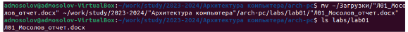{#fig:018 width=70%}

Сохраним изменения на сервере.

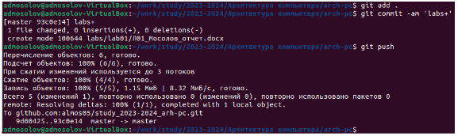{#fig:019 width=70%}

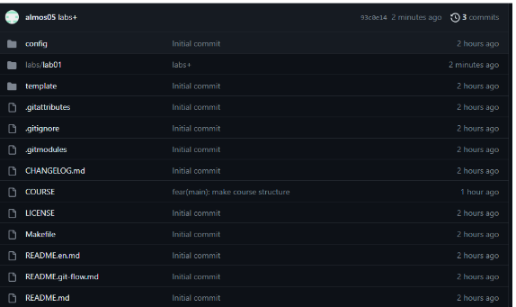{#fig:020 width=70%}

# Выводы

В ходе выполнения лабораторной работы были изучены базовые команды и их
опции для работы с *git*. Были приобретены практические навыки взаимодействия с
системой контроля версий.
